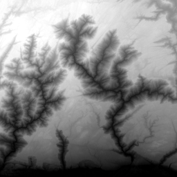

<!-- ABOUT THE PROJECT -->
## About The Project
You can download HeightMap from Mapbox provided data.

## Implementation 
1. Unzip "oraociei12.zip" into Dependency folder. Then add "Dependency" folder's path as Environment Variable in your PC.
2. Provide a Geographic Extent as a shape file if you have (Way 1). 

            var feature = FeatureSet.Open(@"D:\3DTerrainInfoGenerationProject\BuildingProject\Resource\Extent.shp");
            int zoom = 11;
            string output_folder = @"D:\3DTerrainInfoGenerationProject\BuildingProject\Resource\HeightData";
            int image_dimension = 1080;//square shaped image
            Console.WriteLine($"Required Extent: {feature.Extent.MinX} {feature.Extent.MinY} {feature.Extent.MaxX} {feature.Extent.MaxY}");
            HeightMapCreator heightMapCreator = new HeightMapCreator(
                zoom, feature.Extent.MinX, feature.Extent.MinY,
                feature.Extent.MaxX, feature.Extent.MaxY,
                output_folder, image_dimension
                );
            if (heightMapCreator.getHeightMap())
                Console.WriteLine("Done!");
                
3. If you dont have shape file use Way 2. Just provide center coord (ex. Lang:90.634673, Lat:24.8734975) and provide your desire width in KM (Top-left to Top-Right).        
## Output

